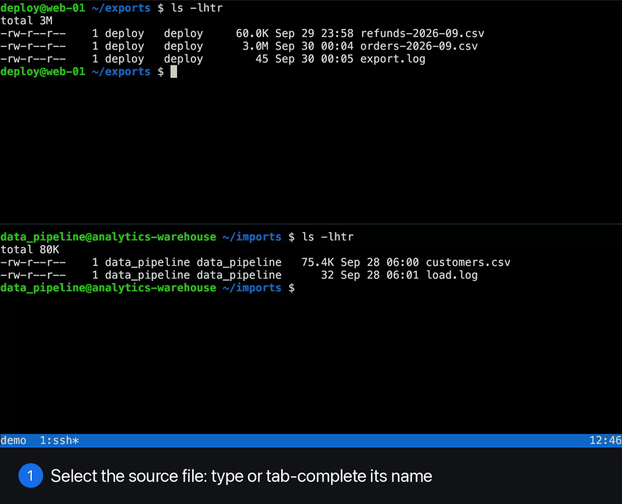

# tmux-scp

Copy files between tmux panes, even when they are logged in to different hosts.
Point at the files, yank, switch to the other pane, put.



## Why

You are looking at a file on `app-1` in one pane, and it needs to go to `db-2`,
where you have a shell open in another pane. With scp, you first have to gather
five things: both hostnames, both directories and the file name. They are all
on your screen already, and you still type them out again in a third, local
shell:

```
scp -3 app-1.example.com:/home/me/logs/report.csv db-2.example.com:/home/me/tmp/
```

tmux-scp reads them from your screen instead.

## How it works

Think of copy and paste in a file manager, except the selection is simply your
command line:

```
1. In the pane with the files, type or tab-complete their names.
   Don't press Enter. Any command works; ls is handy.

   +- app-1 ---------------------------------------------------+
   | me@app-1 ~/logs $ ls report.csv errors.log                 |
   +------------------------------------------------------------+

2. Press prefix C-y. tmux-scp notes the host, directory and files:

   tmux-scp: yanked 2 files (report.csv, errors.log) from me@app-1.example.com:/home/me/logs

3. Go to the destination: another split, window or session.

   +- db-2 ----------------------------------------------------+
   | me@db-2 ~/tmp $                                            |
   +------------------------------------------------------------+

4. Press prefix C-p. A popup shows what is about to happen, y copies:

   +- tmux-scp: put 2 files ------------------------------------+
   |                                                            |
   |  me@app-1.example.com  ~/logs                              |
   |    |  report.csv    12.3 KB                                |
   |    |  errors.log     4.1 MB                                |
   |    v                                                       |
   |  me@db-2.example.com   ~/tmp                               |
   |    !  errors.log        0 B  will be overwritten           |
   |                                                            |
   |  y copy 2 files, 4.1 MB, any other key cancels             |
   +------------------------------------------------------------+
```

That is the whole flow. The only thing you type is file names, and you
tab-completed those anyway. The yank sticks around, so you can put the same
files in several places, and the two panes can be anywhere in tmux.

If the command already ran and you are at a fresh prompt, that works too:
tmux-scp then uses the last command line above the cursor with the same prompt.

## Beyond yank and put

The same thing works as tmux commands (`prefix :`), with places you name:

| To | Type |
|----|------|
| copy between two panes you can see | `:scp top bottom` (or `left`, `right`, `last`, `marked`, `%24`, ...) |
| copy from the current pane to another | `:scp bottom` |
| send a local file you have the path of | `:scp ~/Downloads/dump.sql bottom` |
| fetch files into a local directory | `:scp top ~/tmp` |
| fetch one file under a new name | `:scp top ~/tmp/new-name.txt` |
| copy a file's contents to the clipboard | `:scp clip` (the one file on the current command line) |
| save the clipboard text as a file on a host | `:scp clip bottom` (asks for a name) |
| yank files copied in Finder, or paths copied as text | `:yank clip`, then prefix C-p |
| put the yank somewhere without going there | `:put ~/tmp`, `:put clip` |
| download the yank to a local scratch directory | `:fetch` (into `/tmp/tmux-scp`) |
| download from a pane without yanking first | `:fetch top` |

In any copy's popup, `c` instead of `y` also puts the new paths on the
clipboard, one per line, as `user@host:path` for remote ones. With `:fetch`,
that is a quick way to get a file from a host into a Claude or other local
session: yank it, `:fetch`, `c`, and paste the path.

A place is one of:

- **a pane**: a tmux target like `%24` or `:4.2`, or the shorthands `top`,
  `bottom`, `left`, `right`, `last` and `marked`. Left out, it means the
  current pane.
- **a local path**: anything starting with `/` or `~`. Quote paths with spaces
  and globs: `:scp '~/exports/*.csv' bottom`.
- **`clip`**: the clipboard.

## Install

Requirements on your machine:

- macOS (only the clipboard parts are macOS specific, see below)
- tmux 3.3 or newer
- `/usr/bin/python3`, which comes with the Xcode Command Line Tools
- OpenSSH, with key or agent based login to your hosts: lookups use
  `BatchMode`, so they cannot answer password prompts

On the hosts: a POSIX `sh`, and tmux if you use it there.

Clone the repo and load the plugin in `~/.tmux.conf`:

```
git clone https://github.com/wellle/tmux-scp ~/.tmux/plugins/tmux-scp
```

```
run-shell ~/.tmux/plugins/tmux-scp/tmux-scp.tmux
```

With [TPM](https://github.com/tmux-plugins/tpm), add
`set -g @plugin 'wellle/tmux-scp'` instead. Then reload the config
(`tmux source-file ~/.tmux.conf`).

Options, set them before the plugin loads:

| Option | Default | |
|--------|---------|-|
| `@tmux-scp-yank-key` | `C-y` | prefix key to yank |
| `@tmux-scp-put-key` | `C-p` | prefix key to put (many configs have `p` as `paste-buffer`) |
| `@tmux-scp-alias-index` | `100` | first of the four `command-alias` slots used for `:scp`, `:yank`, `:put` and `:fetch` |
| `@tmux-scp-border-style` | `fg=blue` | style of the popup's border and title |
| `@tmux-scp-fetch-dir` | `/tmp/tmux-scp` | where `:fetch` copies to |

The popup uses colors unless `NO_COLOR` is set.

For the `tmux-scp show` debugging command, link the script into your `PATH`:
`ln -s ~/.tmux/plugins/tmux-scp/tmux-scp ~/bin/`.

### Faster lookups

Each yank or put makes an ssh connection or two to ask the host where you are.
With connection sharing, these reuse a connection that is already open and take
a round trip, not a full login. In `~/.ssh/config`:

```
Host *.example.com
    ControlMaster auto
    ControlPath ~/.ssh/cm-%C
    ControlPersist 10m
    ServerAliveInterval 30
```

### Trying it without servers

[demo/](demo/README.md) has two throwaway hosts in Docker and a separate tmux
setup for them, so you can try the whole flow on your machine.

## How it finds things

**The host** comes from the `ssh` running in the pane, and scp connects with
the same destination, so your `~/.ssh/config` applies as usual.

**The directory** depends on what the pane is:

- A local shell: tmux knows the pane's directory.
- ssh into a remote tmux (`ssh host -t tmux attach -t NAME`): tmux-scp asks
  that tmux session for its active pane's directory and screen, over a
  separate ssh connection.
- Plain ssh, or anything else like GNU screen: tmux-scp reads the directory
  from your prompt, so the prompt has to show it in full (bash's `\w`, as in
  `me@app-1 ~/logs $`). If the prompt shows `user@host`, it has to match where
  the pane's ssh goes. That way a nested ssh or a `sudo -i` shell is refused
  instead of copying to the wrong place.

**The files** are the words after the prompt on the line with the cursor.
Words that are not existing files are dropped (so the `ls` and any flags
disappear), and globs and `~` are expanded like the shell would.

**The copy** is `scp -r`. Between two hosts it is `scp -3`, which streams
through your machine without writing anything to its disk.

## Safety

- Nothing is copied without the popup and a `y`. Files that would be
  overwritten are marked.
- It refuses to copy onto the same directory, into a directory you cannot
  write, several files with the same name, or when the prompt and the ssh
  destination disagree.
- Lookups on remote hosts only read.
- Files between hosts pass through your machine. Mind your rules for where
  production data may go.

## Assumptions and limitations

- **macOS**: the clipboard uses `pbcopy`, `pbpaste` and `osascript` (for files
  copied in Finder). Everything else would also work on Linux.
- **ssh flags**: of the flags on the pane's ssh command, only the user (`-l`)
  and a config file (`-F`, with an absolute path) are carried over; `-p`,
  `-J` and `-i` are refused. Put them in `~/.ssh/config`, or in the `-F` file.
- **Remote tmux**: the session has to be named in the ssh command, or set
  `TMUX_SCP_SESSION`. tmux-scp uses that session's active pane.
- **Prompts** are recognised by ending in `$ `, `# `, `% `, `> ` or `: `.
  Set `TMUX_SCP_PROMPT` to a regex for anything else.
- **Wrapped lines**: very long command lines in plain ssh or GNU screen may
  be cut at the wrap, because tmux cannot tell where they continue.
- **Clipboard**: text only, up to 10 MB, one file at a time.
- **scp** needs `sftp-server` on the hosts (OpenSSH 9 and newer use SFTP for
  scp by default).

## Troubleshooting

`tmux-scp show [PANE]` prints what a pane resolves to: host, remote session,
directory, the command line it read and the files it found. `tmux-scp --help`
has the full reference.

## License

MIT, see [LICENSE](LICENSE).
